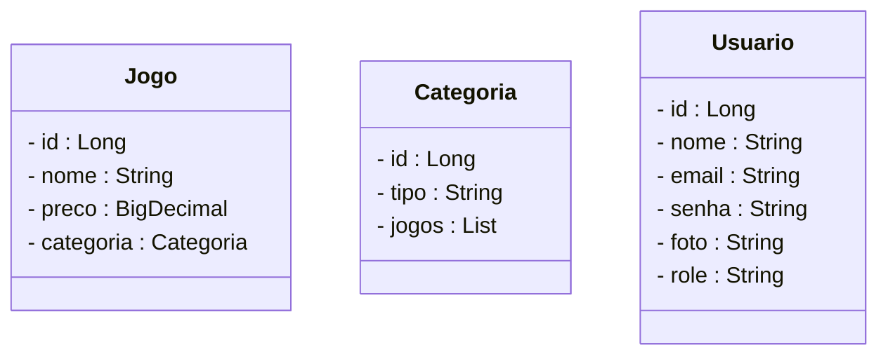

# Projeto Loja de Games Carlos Games - Backend com Spring Boot

<br />

<div align="center">
  
</div>

<br />

<div align="center">
  
  
  
  
  
  
  
</div>

<br />

## 1. Descrição

<br />

A **Loja de Games Carlos Games** é uma aplicação backend robusta e segura, que simula um sistema de e-commerce de jogos. Permite gerenciar um catálogo de jogos, classificá-los por categorias e oferece um sistema completo de gestão e autenticação de usuários.

Este projeto foi desenvolvido com fins educacionais, focando na aplicação prática de conceitos avançados de API REST com Java e Spring Boot, incluindo segurança e integração com serviços externos.

<br />

## 2. Sobre esta API

<br />

A API da Loja de Games Carlos Games foi desenvolvida utilizando **Java** e o **framework Spring Boot**, seguindo os princípios da Arquitetura RESTful. Ela oferece endpoints para o gerenciamento dos recursos **Jogo**, **Categoria** e **Usuário**, com foco em alta segurança e usabilidade.

<br />

### 2.1. Principais funcionalidades da API:

<br />

1.  **Gerenciamento de Jogos:**
    * Criação, listagem, busca por ID, busca por nome e remoção de jogos.
    * Relacionamento **Um para Muitos (One-to-Many)** com Categoria (um jogo pertence a uma categoria).
2.  **Gerenciamento de Categorias:**
    * Criação, listagem, busca por ID, busca por tipo e remoção de categorias.
    * Validação de unicidade para o tipo de categoria (impedindo duplicatas).
3.  **Sistema de Segurança Completo:**
    * **Autenticação de Usuários:** Através de login tradicional (placeholder) e, principalmente, via **Google OAuth2**.
    * **Geração de Token JWT:** Após o login (seja tradicional ou Google OAuth2), é gerado um JSON Web Token para autenticar requisições futuras na API.
    * **Persistência de Usuários OAuth2:** Usuários autenticados via Google são automaticamente cadastrados ou atualizados no banco de dados, com suas informações de perfil e `role` inicial.
    * **Autorização (RBAC):** Controle de acesso baseado em papéis (`ROLE_USER`, `ROLE_ADMIN`). Endpoints são protegidos com base nas permissões do usuário (ex: apenas ADMIN pode criar/editar/deletar jogos e categorias).
4.  **Documentação Interativa:**
    * Utilização do **SpringDoc OpenAPI (Swagger UI)** para documentar todos os endpoints da API.
    * A documentação é protegida e serve como a **página de destino após o login com Google**, ideal para apresentações.

<br />

## 3. Diagrama de Classes

<br />

O **Diagrama de Classes** é um modelo visual que representa a estrutura do sistema, mostrando as classes (`Jogo`, `Categoria`, `Usuário`), seus atributos, métodos e os relacionamentos entre elas.

<br />


Categoria --> Jogo : classifica
Usuario "1" -- "0..*" /* Futuros Pedidos/Compras */ : realiza
```mermaid
erDiagram
  tb_categorias ||--o{ tb_jogos : classifica
  tb_usuarios ||--o{ tb_pedidos : realiza
  
  tb_categorias {
    long id PK
    string tipo UK "UNIQUE"
  }
  tb_jogos {
    long id PK
    string nome
    decimal preco
    long categoria_id FK
  }
  tb_usuarios {
    long id PK
    string nome
    string email UK "UNIQUE"
    string senha
    string foto
    string role
  }
  ```
  # Placeholder para a futura entidade tb_pedidos
  tb_pedidos {


    long id PK
    long usuario_id FK
    string data_pedido
    decimal total
  }
5. Tecnologias utilizadas
&lt;br />

Item	Descrição
Servidor	Tomcat
Linguagem de programação	Java (JDK 21)
Framework	Spring Boot 3.x
ORM	JPA + Hibernate
Banco de dados Relacional	MySQL
Segurança	Spring Security
Autenticação	JWT, Google OAuth2
Testes automatizados	JUnit (configurado)
Documentação	SpringDoc OpenAPI (Swagger UI)
Ferramentas de Desenvolvimento	Spring Tool Suite (STS), Insomnia / Postman

Exportar para as Planilhas
&lt;br />

6. Requisitos
&lt;br />

Para executar os códigos localmente, você precisará:

Java JDK 21+
Banco de dados MySQL (com credenciais root/root ou as suas configuradas)
STS
Insomnia ou Postman
Acesso ao Google Cloud Console para configurar as credenciais OAuth2.
&lt;br />

7. Como Executar o Projeto no STS
&lt;br />

7.1. Configuração Inicial e Credenciais
Clone o repositório do Projeto:
Bash

git clone [https://github.com/carlosmoronisud/seu_repositorio_carlosgames.git](https://github.com/carlosmoronisud/seu_repositorio_carlosgames.git)
# Se o projeto CarlosGames estiver no mesmo repositório do Farmacia, o comando pode ser diferente (ex: clone o repositório principal)
Abra o STS e importe o projeto CarlosGames:
No menu superior do STS, clique em: File 🡲 Import...
Selecione: General 🡲 Existing Projects into Workspace e clique em Next.
Em Select root directory, clique em Browse... e selecione a pasta CarlosGames (ou a pasta do projeto) dentro do repositório clonado.
Clique em Finish.
Configure as credenciais Google OAuth2:
No Google Cloud Console, crie um projeto e um OAuth 2.0 Client ID do tipo "Web application" (ou use o existente).
Adicione http://localhost:8080 em "Authorized JavaScript origins".
Adicione http://localhost:8080/login/oauth2/code/google em "Authorized redirect URIs".
Anote seu Client ID e Client Secret.
Crie o arquivo de configuração local (se não existir):
Na pasta src/main/resources do seu projeto CarlosGames, crie um novo arquivo chamado application-local.properties.
Adicione suas credenciais reais neste arquivo:
Properties

spring.security.oauth2.client.registration.google.client-id=SEU_CLIENT_ID_DO_GOOGLE
spring.security.oauth2.client.registration.google.client-secret=SEU_CLIENT_SECRET_DO_GOOGLE
NÃO COMITE ESTE ARQUIVO! Adicione /src/main/resources/application-local.properties ao seu .gitignore.
Configure o Banco de Dados:
Verifique o arquivo src/main/resources/application.properties para as configurações de conexão com o MySQL. Certifique-se de que o username e password correspondem aos do seu MySQL local. O nome do banco de dados será db_carlosgames.
&lt;br />

7.2. Executando o Projeto
Atualize as dependências Maven:
No STS, clique com o botão direito no Projeto Carlos Games.
Vá em Maven 🡲 Update Project....
Marque Force Update of Snapshots/Releases e clique em OK.
Limpe o Projeto:
No STS, vá em Project 🡲 Clean....
Selecione o Projeto Carlos Games e clique em Clean.
Inicie a Aplicação:
Na Guia Boot Dashboard, localize o Projeto Carlos Games.
Selecione-o e clique no botão Start or Restart.
Acompanhe a inicialização no console do STS. Verifique se o banco de dados db_carlosgames foi criado/atualizado e se as tabelas foram geradas automaticamente.
&lt;br />

7.3. Testando a API e a Segurança
Login com Google e Acesso à Documentação (Protegida):
Abra seu navegador e acesse: http://localhost:8080/oauth2/authorization/google
Conclua o processo de autenticação com sua conta Google.
Após o login, você será redirecionado automaticamente para a Documentação da API (Swagger UI) em http://localhost:8080/swagger-ui.html.
Testando Endpoints Protegidos via Swagger UI ou Insomnia:
Obtenha o JWT: Após o login Google, o JWT estará visível na URL de redirecionamento (na barra de endereço do navegador, se configurado para isso). Copie-o.
Requisições Protegidas: Para endpoints como GET /jogos ou GET /categorias, inclua o cabeçalho Authorization: Bearer SEU_JWT_AQUI.
Leitura (USER/ADMIN): GET /jogos, GET /categorias - Esperado: 200 OK com JWT válido.
Escrita/Deleção (ADMIN): POST /jogos, PUT /jogos, DELETE /jogos/{id}, POST /categorias, PUT /categorias, DELETE /categorias/{id} - Exige ROLE_ADMIN.
Para testar ROLE_ADMIN, mude manualmente a role do seu usuário no banco de dados de ROLE_USER para ROLE_ADMIN na tabela tb_usuarios, reinicie a aplicação, e faça um novo login Google para obter um JWT atualizado com a nova role.
Esperado: 201 Created, 200 OK, 204 No Content com JWT de ROLE_ADMIN.
Esperado: 403 Forbidden com JWT de ROLE_USER em endpoints de ADMIN.
&lt;br />

[!TIP]

Após o login com Google, o sistema de segurança do Spring Boot mantém sua sessão autenticada. Se você tentar acessar http://localhost:8080/swagger-ui.html diretamente após o login, o acesso será permitido. Se tentar sem ter logado, você será redirecionado para o fluxo de autenticação.

&lt;br />

8. Implementações Futuras
&lt;br />

[ ] Implementar um Controller para o recurso Usuario (com cadastro e login tradicional, etc.).
[ ] Adicionar testes unitários e de integração mais abrangentes.
[ ] Configurar o deploy da aplicação em um ambiente de nuvem (ex: Heroku, AWS, Google Cloud).
[ ] Desenvolver um frontend para consumir a API.
&lt;br />

9. Contribuição
&lt;br />

Este repositório é parte de um projeto educacional da Generation Brasil. Contribuições, sugestões e melhorias são sempre bem-vindas! Sinta-se à vontade para:

Criar uma issue para relatar bugs ou sugerir funcionalidades.
Enviar um pull request com suas implementações.
Compartilhar com colegas que estejam aprendendo Java e Spring Boot!
&lt;br />

10. Contato
&lt;br />

Desenvolvido por Carlos Moronisud
Para dúvidas, sugestões ou colaborações, entre em contato via GitHub ou abra uma issue!